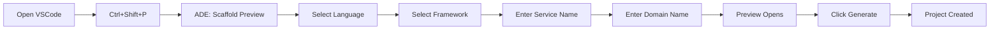

# VSCode Extension Build & Deployment Guide

This guide covers building, packaging, and deploying the ADE VSCode extension.

## Prerequisites

- Node.js 20+ and pnpm installed
- VSCode installed on your system
- Git repository cloned
- CLI tool built (required for extension functionality)

## Quick Start

### 1. Install Dependencies

```bash
cd vscode-extension
pnpm install
```

### 2. Build the Extension

```bash
# Compile TypeScript to JavaScript
pnpm run compile

# Or watch for changes during development
pnpm run watch
```

### 3. Package the Extension

```bash
# Create .vsix package file
pnpm run package
```

This creates `ade-0.0.1.vsix` in the extension directory.

## Installation Methods

### Method 1: Command Line Installation (Windows)

```cmd
# Navigate to extension directory
cd C:\path\to\ade-platform\vscode-extension

# Install the extension
code --install-extension ade-0.0.1.vsix

# Verify installation
code --list-extensions | findstr ade
```

### Method 2: Command Line Installation (WSL/Linux/Mac)

```bash
# If 'code' command is not available in WSL, first set it up:
alias code="/mnt/c/Program\ Files/Microsoft\ VS\ Code/Code.exe"

# Install the extension
code --install-extension ade-0.0.1.vsix

# Verify installation
code --list-extensions | grep ade
```

### Method 3: Manual Installation via VSCode UI

1. Open VSCode
2. Go to Extensions view (`Ctrl+Shift+X`)
3. Click the `...` menu at the top of the Extensions sidebar
4. Select "Install from VSIX..."
5. Navigate to the `.vsix` file and select it
6. Click "Install"
7. Reload VSCode when prompted

### Method 4: Development Mode (For Testing)

1. Open the extension source in VSCode:
   ```bash
   cd vscode-extension
   code .
   ```

2. Press `F5` to launch Extension Development Host
3. A new VSCode window opens with the extension loaded
4. Test your extension in this new window

## Building from Source

### Full Build Process

```bash
# 1. Clean previous builds
rm -rf out/ *.vsix

# 2. Install dependencies
pnpm install

# 3. Compile TypeScript
pnpm run compile

# 4. Package extension
pnpm run package
```

### Build Script (Automated)

Create a build script `build.sh`:

```bash
#!/bin/bash
set -e

echo "🔨 Building ADE VSCode Extension..."

# Navigate to extension directory
cd "$(dirname "$0")/vscode-extension"

# Clean
echo "🧹 Cleaning previous builds..."
rm -rf out/ *.vsix

# Install dependencies
echo "📦 Installing dependencies..."
pnpm install

# Compile
echo "🔧 Compiling TypeScript..."
pnpm run compile

# Package
echo "📦 Creating VSIX package..."
pnpm run package

echo "✅ Build complete! Extension package: ade-*.vsix"
```

## Deployment Options

### 1. Local Deployment (Single User)

```bash
# Install for current user
code --install-extension ade-0.0.1.vsix
```

### 2. Team Deployment (Multiple Users)

Share the `.vsix` file with your team via:
- Git repository (add to releases)
- Network drive
- Internal package registry

Team members install using:
```bash
code --install-extension path/to/ade-0.0.1.vsix
```

### 3. VS Code Marketplace (Public)

1. Create a publisher account at https://marketplace.visualstudio.com
2. Install vsce tool:
   ```bash
   pnpm install -g @vscode/vsce
   ```
3. Package and publish:
   ```bash
   vsce package
   vsce publish
   ```

### 4. Private Extension Registry

For enterprise environments, use:
- Open VSX Registry
- Private GitHub releases
- Azure DevOps Extension Management

## Running the Extension

### First Run

1. **Open VSCode** with the extension installed
2. **Open a project folder** where you want to scaffold services
3. **Open Command Palette** (`Ctrl+Shift+P`)
4. **Type "ADE"** to see available commands:
   - `ADE: Scaffold Preview` - Interactive scaffolding with preview
   - `ADE: Generate Project` - Generate from preview

### Usage Workflow



### Configuration

1. Go to Settings (`Ctrl+,`)
2. Search for "ADE"
3. Configure:
   - `ade.coreBinaryPath`: Path to CLI tool (default: `ade-core`)

Example configuration:
```json
{
  "ade.coreBinaryPath": "C:\\path\\to\\ade-platform\\cli\\dist\\index.js"
}
```

## Testing the Extension

### Basic Test

```bash
# 1. Build CLI tool (required)
cd cli
pnpm run build
cd ..

# 2. Launch extension in development mode
cd vscode-extension
code .
# Press F5

# 3. In the new VSCode window, run:
# Ctrl+Shift+P -> ADE: Scaffold Preview
```

### Test Checklist

- [ ] Extension loads without errors
- [ ] Commands appear in Command Palette
- [ ] Language selection works (python/node/go)
- [ ] Framework selection updates based on language
- [ ] Service name validation works
- [ ] Domain name validation works
- [ ] Preview panel opens with correct content
- [ ] File tree displays correctly
- [ ] Code syntax highlighting works
- [ ] Copy button works
- [ ] Generate button creates project

## Troubleshooting

### Common Issues

| Issue | Solution |
|-------|----------|
| "Command 'ADE: Scaffold Preview' not found" | Reload VSCode: `Ctrl+Shift+P` → "Developer: Reload Window" |
| "CLI not found" error | Build CLI: `cd cli && pnpm run build` |
| "Cannot find module" error | Rebuild: `pnpm install && pnpm run compile` |
| Preview shows "undefined" | Update extension: Rebuild and reinstall |
| Extension doesn't activate | Check activation events in package.json |

### Debug Mode

1. Open extension in VSCode
2. Set breakpoints in TypeScript files
3. Press `F5` to launch with debugger
4. Check Debug Console for output

### Logging

Add logging to help debug issues:

```typescript
// In extension code
const outputChannel = vscode.window.createOutputChannel('ADE Platform');
outputChannel.appendLine(`Debug: ${message}`);
outputChannel.show();
```

### Check Installation

```bash
# List installed extensions
code --list-extensions

# Check extension details
code --inspect-extensions your-org.ade

# Uninstall if needed
code --uninstall-extension your-org.ade
```

## Development Workflow

### Recommended Setup

```bash
# Terminal 1: Watch TypeScript compilation
cd vscode-extension
pnpm run watch

# Terminal 2: Watch CLI compilation
cd cli
pnpm run dev

# VSCode: Press F5 to test
```

### Hot Reload

In Extension Development Host:
- Press `Ctrl+R` to reload extension
- No need to restart VSCode

### Version Management

Update version in `package.json`:
```json
{
  "version": "0.0.2"
}
```

Then rebuild and package:
```bash
pnpm run package
```

## CI/CD Integration

### GitHub Actions Workflow

```yaml
name: Build Extension

on:
  push:
    tags: ['v*']

jobs:
  build:
    runs-on: ubuntu-latest
    steps:
      - uses: actions/checkout@v4

      - name: Setup Node.js
        uses: actions/setup-node@v4
        with:
          node-version: '20'

      - name: Setup pnpm
        uses: pnpm/action-setup@v2
        with:
          version: 8.15.1

      - name: Build Extension
        run: |
          cd vscode-extension
          pnpm install
          pnpm run package

      - name: Upload Artifact
        uses: actions/upload-artifact@v4
        with:
          name: vscode-extension
          path: vscode-extension/*.vsix
```

## Best Practices

1. **Always test locally** before distributing
2. **Version appropriately** using semantic versioning
3. **Document changes** in CHANGELOG.md
4. **Test on multiple platforms** if targeting diverse users
5. **Keep CLI and extension versions in sync**
6. **Include error handling** for better user experience

## Quick Commands Reference

```bash
# Development
pnpm install          # Install dependencies
pnpm run compile      # Compile TypeScript
pnpm run watch        # Watch mode
pnpm run package      # Create VSIX

# Installation
code --install-extension ade-*.vsix    # Install
code --uninstall-extension your-org.ade # Uninstall
code --list-extensions | grep ade       # Verify

# Testing
F5                    # Launch Extension Host
Ctrl+R                # Reload extension
Ctrl+Shift+P          # Command Palette
Ctrl+Shift+I          # Developer Tools
```

## Support

- Report issues: https://github.com/phdsystems/ade-platform/issues
- Documentation: https://github.com/phdsystems/ade-platform/docs
- CLI help: `ade-core --help`